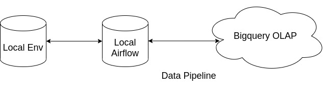

## Airflow + data wrangling demo



## How to use this repo

Here are some brief about how to run this repo ( will use ubuntu OS for this brief ) :

1. Please download the anaconda package to run the Jupyter notebook ( for data exploring ), you can also use google colab if you want to, here is the link 
```
https://www.anaconda.com/products/individual
```
2. If you have trouble installing it, please follow this guide here 
```
https://linuxize.com/post/how-to-install-anaconda-on-ubuntu-20-04/
```
3. Please make sure to download the package that binds python 3.8
4. Install it in your local environment
5. Activate the conda environment so it won't disrupt your env
6. Clone this repo by using the command 
```
git clone https://github.com/farizi-maker/demo.git
```
7. Deploy anaconda navigator in a terminal by type anaconda-navigator
8. Launch jupyter notebook, then move to the cloned repo
9. Please open data_wrangling.ipynb inside the solution directory to start exploring the data
10. Next, let's start using airflow, please use command below to start the installation of our orchestrator
```
pip install "apache-airflow[celery]==2.1.4" --constraint "https://raw.githubusercontent.com/apache/airflow/constraints-2.1.4/constraints-3.8.txt"
```
11. Please install the google provider
 ```
 pip install apache-airflow-providers-google==6.1.0
 ```
12. After the pip package has been installed, move to the demo directory, and please put the command below in the terminal so that airflow will recognize the home directory
```
 export AIRFLOW_HOME=$(pwd)
```
13. Start typing the command below so that our dag will be recognized
```
airflow db init
```
14. add initial user as admin in airflow
```
airflow users create  --username username --password password  --firstname john --lastname doe --role Admin --email anyvalidemailaddress
```
15. after finish initiation, create new terminal, follow step 12-13, then please put command below 
```
first terminal airflow webserver
second terminal : airflow scheduler
```
16. After this step, the rest is yours to make some customization about how the OLAP will be deployed, how the connection will be built between the airflow and OLAP, etc.


## Resources

There are three tables, which are `accounts`, `cards`, and `saving_accounts`. <br>
An account can have up to one concurrent active card and one concurrent active savings_account. <br>
You are given the event logs of those tables in the respective directory name under `data` directory.

The event logs are of JSON format, and the fields definition are:

| Field | Description |
|:-----:|-------------|
| id | ID of the DB record |
| op | type of DB operation. 'c' means `create` and 'u' means `update` |
| ts | timestamp when the event happened |
| data | DB record field / value pairs. Only exists in event of type 'c' |
| set | Updated DB record field / value pairs. Only exists in event of type 'u' |


